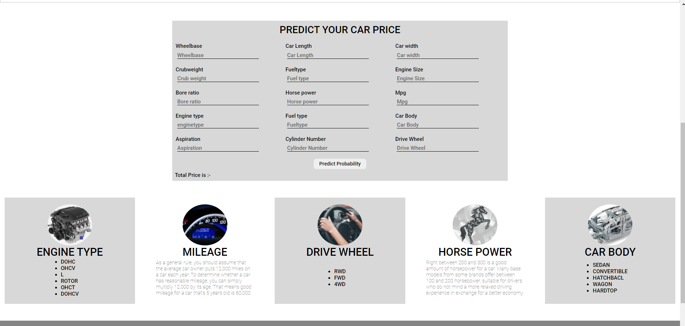

This data science project series walks through step by step process of how to build a car price prediction website. We will first build a model using sklearn and linear regression using automobile company X-Auto dataset . Second step would be to write a python flask server that uses the saved model to serve http requests. Third component is the website built in html, css that allows user to enter Car Body, milage , wheelbase , fueltype , enginesize , horsepower etc and it will call python flask server to retrieve the predicted price. Technology and tools wise this project covers,

1. Python
2. Numpy and Pandas for data cleaning
3. Matplotlib for data visualization
4. Sklearn for model building
5. Jupyter notebook, visual studio code as IDE
6. Python flask for http server
7. HTML/CSS for UI
